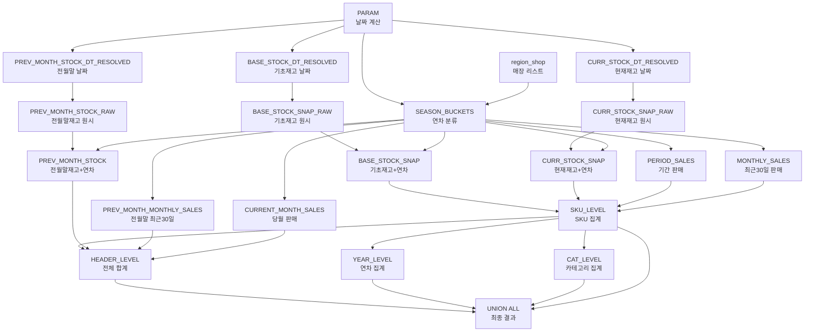

# 섹션3: 과시즌 재고 소진현황 - 전체 로직 및 쿼리

## 📋 목차
1. [개요](#개요)
2. [비즈니스 로직](#비즈니스-로직)
3. [SQL 쿼리 전체](#sql-쿼리-전체)
4. [CTE 상세 설명](#cte-상세-설명)
5. [계산 공식](#계산-공식)
6. [프론트엔드 로직](#프론트엔드-로직)

---

## 개요

### 목적
과거 시즌(F/S) 재고의 소진 현황을 연차별(1년차/2년차/3년차 이상)로 집계하여 재고 관리 지표 제공

### 데이터 소스
- **재고**: `SAP_FNF.DW_HMD_STOCK_SNAP_D` (일별 스냅샷)
- **판매**: `SAP_FNF.DW_HMD_SALE_D` (일별 판매)

### 출력 레벨
1. **HEADER**: 전체 합계
2. **YEAR**: 연차별 집계 (1년차, 2년차, 3년차 이상)
3. **CAT**: 카테고리별 집계
4. **SKU**: 제품별 상세

---

## 비즈니스 로직

### 1. 시즌 타입 판단

| 월 | 시즌 타입 | 기초재고일 | 판매기간 시작 |
|---|---------|-----------|------------|
| 9~2월 | FW (Fall/Winter) | YYYY-09-30 | YYYY-10-01 |
| 3~8월 | SS (Spring/Summer) | YYYY-02-28(29) | YYYY-03-01 |

**예시:**
- `ASOF=2026-02-02` → FW 시즌, 기초=2025-09-30, 판매기간=2025-10-01~2026-02-02
- `ASOF=2026-03-15` → SS 시즌, 기초=2026-02-28, 판매기간=2026-03-01~2026-03-15

### 2. 연차 버킷 분류

**현재 시즌 연도(YY) 계산:**
```
- FW 시즌 (9~2월):
  - 9~12월: 현재 연도 YY (예: 2025년 9월 → 25)
  - 1~2월: 전년 연도 YY (예: 2026년 1월 → 25)
- SS 시즌 (3~8월):
  - 현재 연도 YY (예: 2026년 3월 → 26)
```

**연차 분류:**
```
현재 시즌 = 25F인 경우:
- 1년차: 24F (CUR_YY - 1)
- 2년차: 23F (CUR_YY - 2)
- 3년차 이상: ~22F (CUR_YY - 3 이하)
```

### 3. 정체재고 정의

**조건:**
- 현재재고 > 0 이면서
- 최근 30일 판매가 없음 **또는**
- 최근 30일 판매 < 현재재고 × 0.1%

**목적:** 움직임이 거의 없는 재고 식별

### 4. 주요 지표

| 지표 | 설명 | 계산 공식 |
|------|------|----------|
| **기초재고** | 시즌 시작 시점 재고 | `BASE_STOCK_DT` 기준 스냅샷 |
| **현재재고** | ASOF 시점 재고 | `ASOF_DATE + 1일` 기준 스냅샷 |
| **정체재고** | 움직이지 않는 재고 | 최근 30일 판매 없음 or < 0.1% |
| **정체재고비중** | 현재재고 대비 정체재고 비율 | `정체재고 / 현재재고 × 100` |
| **소진재고액** | 판매기간 동안 판매된 금액 | `PERIOD_TAG_SALES` |
| **할인율** | 판매 시 할인 비율 | `1 - (실판매액 / TAG판매액)` |
| **재고일수** | 현재 판매속도로 재고 소진까지 일수 | `현재재고 × 기간일수 / 기간판매액` |

---

## SQL 쿼리 전체

### 쿼리 구조 다이어그램



### 전체 SQL 쿼리

```sql
WITH
-- 1. 매장 리스트 CTE (동적 생성)
region_shop AS (
  SELECT column1 AS local_shop_cd
  FROM VALUES
    ('H01'), ('H02'), ('H03'), ... -- 지역/브랜드별 매장
),

-- 2. 파라미터 계산 CTE (31개 파라미터)
PARAM AS (
  SELECT
    CAST(? AS DATE) AS ASOF_DATE,
    -- 전월말 날짜
    LAST_DAY(DATEADD(MONTH, -1, CAST(? AS DATE))) AS PREV_MONTH_END_DT,
    -- 당월 1일
    DATE_TRUNC('MONTH', CAST(? AS DATE)) AS CURRENT_MONTH_START_DT,
    
    -- 현재 시즌 타입 판단 (9~2월=FW, 3~8월=SS)
    CASE 
      WHEN MONTH(CAST(? AS DATE)) IN (9,10,11,12,1,2) THEN 'F' 
      ELSE 'S' 
    END AS CUR_TYP,
    
    -- 현재 시즌 연도(YY)
    CASE
      WHEN MONTH(CAST(? AS DATE)) IN (9,10,11,12) THEN MOD(YEAR(CAST(? AS DATE)), 100)
      WHEN MONTH(CAST(? AS DATE)) IN (1,2) THEN MOD(YEAR(CAST(? AS DATE)) - 1, 100)
      ELSE MOD(YEAR(CAST(? AS DATE)), 100)
    END AS CUR_YY,
    
    -- 기초재고일 산정
    CASE
      WHEN MONTH(CAST(? AS DATE)) IN (9,10,11,12,1,2) THEN
        -- FW: YYYY-09-30
        CASE
          WHEN MONTH(CAST(? AS DATE)) IN (9,10,11,12) THEN
            CAST(YEAR(CAST(? AS DATE)) || '-09-30' AS DATE)
          ELSE
            CAST((YEAR(CAST(? AS DATE)) - 1) || '-09-30' AS DATE)
        END
      ELSE
        -- SS: YYYY-02-28 or 02-29 (윤년)
        CASE
          WHEN MOD(YEAR(CAST(? AS DATE)), 4) = 0 
               AND (MOD(YEAR(CAST(? AS DATE)), 100) != 0 
                    OR MOD(YEAR(CAST(? AS DATE)), 400) = 0) THEN
            CAST(YEAR(CAST(? AS DATE)) || '-02-29' AS DATE)
          ELSE
            CAST(YEAR(CAST(? AS DATE)) || '-02-28' AS DATE)
        END
    END AS BASE_STOCK_DT,
    
    -- 판매기간 시작일
    CASE
      WHEN MONTH(CAST(? AS DATE)) IN (9,10,11,12,1,2) THEN
        -- FW: YYYY-10-01
        CASE
          WHEN MONTH(CAST(? AS DATE)) IN (9,10,11,12) THEN
            CAST(YEAR(CAST(? AS DATE)) || '-10-01' AS DATE)
          ELSE
            CAST((YEAR(CAST(? AS DATE)) - 1) || '-10-01' AS DATE)
        END
      ELSE
        -- SS: YYYY-03-01
        CAST(YEAR(CAST(? AS DATE)) || '-03-01' AS DATE)
    END AS PERIOD_START_DT,
    
    -- 판매기간 일수
    DATEDIFF(day,
      CASE
        WHEN MONTH(CAST(? AS DATE)) IN (9,10,11,12,1,2) THEN
          CASE
            WHEN MONTH(CAST(? AS DATE)) IN (9,10,11,12) THEN
              CAST(YEAR(CAST(? AS DATE)) || '-10-01' AS DATE)
            ELSE
              CAST((YEAR(CAST(? AS DATE)) - 1) || '-10-01' AS DATE)
          END
        ELSE
          CAST(YEAR(CAST(? AS DATE)) || '-03-01' AS DATE)
      END,
      CAST(? AS DATE)
    ) + 1 AS PERIOD_DAYS
),

-- 3. 과시즌 버킷 정의 (1년차/2년차/3년차 이상)
SEASON_BUCKETS AS (
  SELECT DISTINCT
    s.SESN,
    CAST(LEFT(s.SESN, 2) AS INTEGER) AS SESN_YY,
    RIGHT(s.SESN, 1) AS SESN_TYP,
    PA.CUR_TYP,
    PA.CUR_YY,
    CASE
      -- FW 시즌 중: F 시즌만 연차별로 표시
      WHEN PA.CUR_TYP='F' AND RIGHT(s.SESN, 1)='F' THEN
        CASE
          WHEN CAST(LEFT(s.SESN, 2) AS INTEGER) = PA.CUR_YY-1 THEN '1년차'
          WHEN CAST(LEFT(s.SESN, 2) AS INTEGER) = PA.CUR_YY-2 THEN '2년차'
          WHEN CAST(LEFT(s.SESN, 2) AS INTEGER) <= PA.CUR_YY-3 THEN '3년차 이상'
          ELSE NULL
        END
      -- SS 시즌 중: S 시즌만 연차별로 표시
      WHEN PA.CUR_TYP='S' AND RIGHT(s.SESN, 1)='S' THEN
        CASE
          WHEN CAST(LEFT(s.SESN, 2) AS INTEGER) = PA.CUR_YY-1 THEN '1년차'
          WHEN CAST(LEFT(s.SESN, 2) AS INTEGER) = PA.CUR_YY-2 THEN '2년차'
          WHEN CAST(LEFT(s.SESN, 2) AS INTEGER) <= PA.CUR_YY-3 THEN '3년차 이상'
          ELSE NULL
        END
      ELSE NULL
    END AS YEAR_BUCKET
  FROM (
    -- 판매 테이블에서 시즌 수집
    SELECT DISTINCT SESN
    FROM SAP_FNF.DW_HMD_SALE_D
    WHERE (CASE WHEN BRD_CD IN ('M','I') THEN 'M' ELSE BRD_CD END) = 'M'
      AND RIGHT(SESN, 1) IN ('F', 'S')
      AND LOCAL_SHOP_CD IN (SELECT local_shop_cd FROM region_shop)
    UNION
    -- 재고 테이블에서 시즌 수집
    SELECT DISTINCT SESN
    FROM SAP_FNF.DW_HMD_STOCK_SNAP_D
    WHERE (CASE WHEN BRD_CD IN ('M','I') THEN 'M' ELSE BRD_CD END) = 'M'
      AND RIGHT(SESN, 1) IN ('F', 'S')
      AND LOCAL_SHOP_CD IN (SELECT local_shop_cd FROM region_shop)
  ) s
  CROSS JOIN PARAM PA
  WHERE YEAR_BUCKET IS NOT NULL
),

-- 4. 날짜 Fallback 처리 (데이터 없을 경우 이전 날짜 사용)

-- 4-1. 기초재고 날짜
BASE_STOCK_DT_RESOLVED AS (
  SELECT 
    PA.BASE_STOCK_DT,
    COALESCE(
      (SELECT MAX(STOCK_DT) FROM SAP_FNF.DW_HMD_STOCK_SNAP_D 
       WHERE STOCK_DT = PA.BASE_STOCK_DT),
      (SELECT MAX(STOCK_DT) FROM SAP_FNF.DW_HMD_STOCK_SNAP_D 
       WHERE STOCK_DT <= PA.BASE_STOCK_DT)
    ) AS EFFECTIVE_BASE_STOCK_DT
  FROM PARAM PA
),

-- 4-2. 현재재고 날짜
CURR_STOCK_DT_RESOLVED AS (
  SELECT 
    PA.ASOF_DATE,
    COALESCE(
      (SELECT MAX(STOCK_DT) FROM SAP_FNF.DW_HMD_STOCK_SNAP_D 
       WHERE STOCK_DT = DATEADD(day, 1, PA.ASOF_DATE)),
      (SELECT MAX(STOCK_DT) FROM SAP_FNF.DW_HMD_STOCK_SNAP_D 
       WHERE STOCK_DT <= DATEADD(day, 1, PA.ASOF_DATE))
    ) AS EFFECTIVE_CURR_STOCK_DT
  FROM PARAM PA
),

-- 4-3. 전월말 재고 날짜
PREV_MONTH_STOCK_DT_RESOLVED AS (
  SELECT 
    PA.PREV_MONTH_END_DT,
    COALESCE(
      (SELECT MAX(STOCK_DT) FROM SAP_FNF.DW_HMD_STOCK_SNAP_D 
       WHERE STOCK_DT = DATEADD(day, 1, PA.PREV_MONTH_END_DT)),
      (SELECT MAX(STOCK_DT) FROM SAP_FNF.DW_HMD_STOCK_SNAP_D 
       WHERE STOCK_DT <= DATEADD(day, 1, PA.PREV_MONTH_END_DT))
    ) AS EFFECTIVE_PREV_MONTH_STOCK_DT
  FROM PARAM PA
),

-- 5. 재고 스냅샷 수집

-- 5-1. 기초재고 (원시 데이터)
BASE_STOCK_SNAP_RAW AS (
  SELECT
    ST.SESN,
    ST.PRDT_CD,
    SUBSTR(ST.PRDT_CD, 7, 2) AS CAT2,
    SUM(ST.TAG_STOCK_AMT) AS BASE_STOCK_AMT
  FROM SAP_FNF.DW_HMD_STOCK_SNAP_D ST
  CROSS JOIN PARAM PA
  CROSS JOIN BASE_STOCK_DT_RESOLVED BSD
  WHERE (CASE WHEN BRD_CD IN ('M','I') THEN 'M' ELSE BRD_CD END) = 'M'
    AND RIGHT(ST.SESN, 1) = PA.CUR_TYP
    AND LOCAL_SHOP_CD IN (SELECT local_shop_cd FROM region_shop)
    AND ST.STOCK_DT = BSD.EFFECTIVE_BASE_STOCK_DT
  GROUP BY ST.SESN, ST.PRDT_CD
),

-- 5-2. 기초재고 + 연차 버킷 매핑
BASE_STOCK_SNAP AS (
  SELECT
    SB.YEAR_BUCKET,
    BS.SESN,
    BS.PRDT_CD,
    BS.CAT2,
    BS.BASE_STOCK_AMT
  FROM BASE_STOCK_SNAP_RAW BS
  INNER JOIN SEASON_BUCKETS SB ON BS.SESN = SB.SESN
  WHERE SB.YEAR_BUCKET IS NOT NULL
),

-- 5-3. 현재재고 (원시 데이터)
CURR_STOCK_SNAP_RAW AS (
  SELECT
    ST.SESN,
    ST.PRDT_CD,
    SUBSTR(ST.PRDT_CD, 7, 2) AS CAT2,
    SUM(ST.TAG_STOCK_AMT) AS CURR_STOCK_AMT
  FROM SAP_FNF.DW_HMD_STOCK_SNAP_D ST
  CROSS JOIN PARAM PA
  CROSS JOIN CURR_STOCK_DT_RESOLVED CSD
  WHERE (CASE WHEN BRD_CD IN ('M','I') THEN 'M' ELSE BRD_CD END) = 'M'
    AND RIGHT(ST.SESN, 1) = PA.CUR_TYP
    AND LOCAL_SHOP_CD IN (SELECT local_shop_cd FROM region_shop)
    AND ST.STOCK_DT = CSD.EFFECTIVE_CURR_STOCK_DT
  GROUP BY ST.SESN, ST.PRDT_CD
),

-- 5-4. 현재재고 + 연차 버킷 매핑
CURR_STOCK_SNAP AS (
  SELECT
    SB.YEAR_BUCKET,
    CS.SESN,
    CS.PRDT_CD,
    CS.CAT2,
    CS.CURR_STOCK_AMT
  FROM CURR_STOCK_SNAP_RAW CS
  INNER JOIN SEASON_BUCKETS SB ON CS.SESN = SB.SESN
  WHERE SB.YEAR_BUCKET IS NOT NULL
),

-- 6. 판매 데이터 수집

-- 6-1. 기간 판매 (판매기간 시작~ASOF)
PERIOD_SALES AS (
  SELECT
    SB.YEAR_BUCKET,
    S.SESN,
    S.PRDT_CD,
    SUBSTR(S.PRDT_CD, 7, 2) AS CAT2,
    SUM(S.TAG_SALE_AMT) AS PERIOD_TAG_SALES,
    SUM(S.ACT_SALE_AMT) AS PERIOD_ACT_SALES
  FROM SAP_FNF.DW_HMD_SALE_D S
  CROSS JOIN PARAM PA
  INNER JOIN SEASON_BUCKETS SB ON S.SESN = SB.SESN
  WHERE (CASE WHEN BRD_CD IN ('M','I') THEN 'M' ELSE BRD_CD END) = 'M'
    AND S.SALE_DT BETWEEN PA.PERIOD_START_DT AND PA.ASOF_DATE
    AND LOCAL_SHOP_CD IN (SELECT local_shop_cd FROM region_shop)
  GROUP BY SB.YEAR_BUCKET, S.SESN, S.PRDT_CD
),

-- 6-2. 최근 30일 판매 (정체재고 판단용)
MONTHLY_SALES AS (
  SELECT
    SB.YEAR_BUCKET,
    S.SESN,
    S.PRDT_CD,
    SUBSTR(S.PRDT_CD, 7, 2) AS CAT2,
    SUM(S.TAG_SALE_AMT) AS MONTHLY_TAG_SALES
  FROM SAP_FNF.DW_HMD_SALE_D S
  CROSS JOIN PARAM PA
  INNER JOIN SEASON_BUCKETS SB ON S.SESN = SB.SESN
  WHERE (CASE WHEN BRD_CD IN ('M','I') THEN 'M' ELSE BRD_CD END) = 'M'
    AND S.SALE_DT BETWEEN DATEADD(day, -30, PA.ASOF_DATE) AND PA.ASOF_DATE
    AND LOCAL_SHOP_CD IN (SELECT local_shop_cd FROM region_shop)
  GROUP BY SB.YEAR_BUCKET, S.SESN, S.PRDT_CD
),

-- 7. 전월말 데이터 (전월 대비 비교용)

-- 7-1. 전월말 재고 (원시 데이터)
PREV_MONTH_STOCK_RAW AS (
  SELECT
    ST.SESN,
    ST.PRDT_CD,
    SUM(ST.TAG_STOCK_AMT) AS PREV_CURR_STOCK_AMT
  FROM SAP_FNF.DW_HMD_STOCK_SNAP_D ST
  CROSS JOIN PARAM PA
  CROSS JOIN PREV_MONTH_STOCK_DT_RESOLVED PMSD
  WHERE (CASE WHEN BRD_CD IN ('M','I') THEN 'M' ELSE BRD_CD END) = 'M'
    AND RIGHT(ST.SESN, 1) = PA.CUR_TYP
    AND LOCAL_SHOP_CD IN (SELECT local_shop_cd FROM region_shop)
    AND ST.STOCK_DT = PMSD.EFFECTIVE_PREV_MONTH_STOCK_DT
  GROUP BY ST.SESN, ST.PRDT_CD
),

-- 7-2. 전월말 재고 + 연차 버킷 매핑
PREV_MONTH_STOCK AS (
  SELECT
    SB.YEAR_BUCKET,
    PMS.SESN,
    PMS.PRDT_CD,
    PMS.PREV_CURR_STOCK_AMT
  FROM PREV_MONTH_STOCK_RAW PMS
  INNER JOIN SEASON_BUCKETS SB ON PMS.SESN = SB.SESN
  WHERE SB.YEAR_BUCKET IS NOT NULL
),

-- 7-3. 전월말 기준 최근 30일 판매
PREV_MONTH_MONTHLY_SALES AS (
  SELECT
    SB.YEAR_BUCKET,
    S.SESN,
    S.PRDT_CD,
    SUM(S.TAG_SALE_AMT) AS PREV_MONTHLY_TAG_SALES
  FROM SAP_FNF.DW_HMD_SALE_D S
  CROSS JOIN PARAM PA
  INNER JOIN SEASON_BUCKETS SB ON S.SESN = SB.SESN
  WHERE (CASE WHEN BRD_CD IN ('M','I') THEN 'M' ELSE BRD_CD END) = 'M'
    AND S.SALE_DT BETWEEN DATEADD(day, -30, PA.PREV_MONTH_END_DT) AND PA.PREV_MONTH_END_DT
    AND LOCAL_SHOP_CD IN (SELECT local_shop_cd FROM region_shop)
  GROUP BY SB.YEAR_BUCKET, S.SESN, S.PRDT_CD
),

-- 7-4. 당월 판매 (월초~ASOF)
CURRENT_MONTH_SALES AS (
  SELECT
    SB.YEAR_BUCKET,
    S.SESN,
    S.PRDT_CD,
    SUM(S.TAG_SALE_AMT) AS CURRENT_MONTH_TAG_SALES
  FROM SAP_FNF.DW_HMD_SALE_D S
  CROSS JOIN PARAM PA
  INNER JOIN SEASON_BUCKETS SB ON S.SESN = SB.SESN
  WHERE (CASE WHEN BRD_CD IN ('M','I') THEN 'M' ELSE BRD_CD END) = 'M'
    AND S.SALE_DT BETWEEN PA.CURRENT_MONTH_START_DT AND PA.ASOF_DATE
    AND LOCAL_SHOP_CD IN (SELECT local_shop_cd FROM region_shop)
  GROUP BY SB.YEAR_BUCKET, S.SESN, S.PRDT_CD
),

-- 8. SKU 레벨 집계 (제품 단위)
SKU_LEVEL AS (
  SELECT
    3 AS SORT_LEVEL,
    'SKU' AS ROW_LEVEL,
    COALESCE(BS.YEAR_BUCKET, CS.YEAR_BUCKET, PS.YEAR_BUCKET) AS YEAR_BUCKET,
    COALESCE(BS.SESN, CS.SESN, PS.SESN) AS SESN,
    COALESCE(BS.CAT2, CS.CAT2, PS.CAT2) AS CAT2,
    COALESCE(BS.PRDT_CD, CS.PRDT_CD, PS.PRDT_CD) AS PRDT_CD,
    COALESCE(BS.BASE_STOCK_AMT, 0) AS BASE_STOCK_AMT,
    COALESCE(CS.CURR_STOCK_AMT, 0) AS CURR_STOCK_AMT,
    
    -- 정체재고 계산: 최근 1개월 판매가 없거나 < 현재재고 × 0.1%
    CASE
      WHEN COALESCE(CS.CURR_STOCK_AMT, 0) > 0
        AND (
          COALESCE(MS.MONTHLY_TAG_SALES, 0) = 0  -- 판매 없음
          OR COALESCE(MS.MONTHLY_TAG_SALES, 0) < (COALESCE(CS.CURR_STOCK_AMT, 0) * 0.001)  -- 판매 < 0.1%
        )
      THEN COALESCE(CS.CURR_STOCK_AMT, 0)
      ELSE 0
    END AS STAGNANT_STOCK_AMT,
    
    COALESCE(PS.PERIOD_TAG_SALES, 0) AS DEPLETED_STOCK_AMT,  -- 소진재고액 = 판매금액
    COALESCE(PS.PERIOD_TAG_SALES, 0) AS PERIOD_TAG_SALES,
    COALESCE(PS.PERIOD_ACT_SALES, 0) AS PERIOD_ACT_SALES,
    NULL AS DISCOUNT_RATE,
    NULL AS INV_DAYS_RAW,
    NULL AS INV_DAYS,
    0 AS IS_OVER_1Y,
    PA.PERIOD_DAYS
  FROM BASE_STOCK_SNAP BS
  FULL OUTER JOIN CURR_STOCK_SNAP CS
    ON BS.YEAR_BUCKET = CS.YEAR_BUCKET
    AND BS.SESN = CS.SESN
    AND BS.PRDT_CD = CS.PRDT_CD
  FULL OUTER JOIN PERIOD_SALES PS
    ON COALESCE(BS.YEAR_BUCKET, CS.YEAR_BUCKET) = PS.YEAR_BUCKET
    AND COALESCE(BS.SESN, CS.SESN) = PS.SESN
    AND COALESCE(BS.PRDT_CD, CS.PRDT_CD) = PS.PRDT_CD
  LEFT JOIN MONTHLY_SALES MS
    ON COALESCE(BS.YEAR_BUCKET, CS.YEAR_BUCKET) = MS.YEAR_BUCKET
    AND COALESCE(BS.SESN, CS.SESN) = MS.SESN
    AND COALESCE(BS.PRDT_CD, CS.PRDT_CD) = MS.PRDT_CD
  CROSS JOIN PARAM PA
  -- 기초재고가 0인 SKU 제외 (성능 최적화)
  WHERE COALESCE(BS.BASE_STOCK_AMT, 0) > 0
),

-- 9. CAT 레벨 집계 (카테고리 단위)
CAT_LEVEL AS (
  SELECT
    2 AS SORT_LEVEL,
    'CAT' AS ROW_LEVEL,
    YEAR_BUCKET,
    NULL AS SESN,
    CAT2,
    NULL AS PRDT_CD,
    SUM(BASE_STOCK_AMT) AS BASE_STOCK_AMT,
    SUM(CURR_STOCK_AMT) AS CURR_STOCK_AMT,
    SUM(STAGNANT_STOCK_AMT) AS STAGNANT_STOCK_AMT,
    SUM(PERIOD_TAG_SALES) AS DEPLETED_STOCK_AMT,
    SUM(PERIOD_TAG_SALES) AS PERIOD_TAG_SALES,
    SUM(PERIOD_ACT_SALES) AS PERIOD_ACT_SALES,
    
    -- 할인율 계산
    CASE
      WHEN SUM(PERIOD_TAG_SALES) > 0
      THEN 1 - (SUM(PERIOD_ACT_SALES) / NULLIF(SUM(PERIOD_TAG_SALES), 0))
      ELSE 0
    END AS DISCOUNT_RATE,
    
    -- 재고일수 계산 (RAW - 상한 없음)
    CASE
      WHEN SUM(PERIOD_TAG_SALES) > 0
      THEN ROUND(SUM(CURR_STOCK_AMT) * MAX(PERIOD_DAYS) / NULLIF(SUM(PERIOD_TAG_SALES), 0))
      ELSE NULL
    END AS INV_DAYS_RAW,
    
    -- 재고일수 (상한 999일 적용)
    CASE
      WHEN SUM(PERIOD_TAG_SALES) = 0 THEN -1  -- 판매없음 플래그
      WHEN SUM(PERIOD_TAG_SALES) > 0 THEN
        CASE
          WHEN ROUND(SUM(CURR_STOCK_AMT) * MAX(PERIOD_DAYS) / NULLIF(SUM(PERIOD_TAG_SALES), 0)) > 999 
            THEN 999
          ELSE ROUND(SUM(CURR_STOCK_AMT) * MAX(PERIOD_DAYS) / NULLIF(SUM(PERIOD_TAG_SALES), 0))
        END
      ELSE NULL
    END AS INV_DAYS,
    
    -- 365일 초과 여부 (판매없음도 빨간색 표시)
    CASE
      WHEN SUM(PERIOD_TAG_SALES) = 0 THEN 1
      WHEN ROUND(SUM(CURR_STOCK_AMT) * MAX(PERIOD_DAYS) / NULLIF(SUM(PERIOD_TAG_SALES), 0)) > 365 THEN 1
      ELSE 0
    END AS IS_OVER_1Y,
    MAX(PERIOD_DAYS) AS PERIOD_DAYS
  FROM SKU_LEVEL
  WHERE CAT2 IS NOT NULL
  GROUP BY YEAR_BUCKET, CAT2
),

-- 10. YEAR 레벨 집계 (연차 단위)
YEAR_LEVEL AS (
  SELECT
    1 AS SORT_LEVEL,
    'YEAR' AS ROW_LEVEL,
    YEAR_BUCKET,
    MAX(SESN) AS SESN,
    NULL AS CAT2,
    NULL AS PRDT_CD,
    SUM(BASE_STOCK_AMT) AS BASE_STOCK_AMT,
    SUM(CURR_STOCK_AMT) AS CURR_STOCK_AMT,
    SUM(STAGNANT_STOCK_AMT) AS STAGNANT_STOCK_AMT,
    SUM(PERIOD_TAG_SALES) AS DEPLETED_STOCK_AMT,
    SUM(PERIOD_TAG_SALES) AS PERIOD_TAG_SALES,
    SUM(PERIOD_ACT_SALES) AS PERIOD_ACT_SALES,
    
    -- 할인율
    CASE
      WHEN SUM(PERIOD_TAG_SALES) > 0
      THEN 1 - (SUM(PERIOD_ACT_SALES) / NULLIF(SUM(PERIOD_TAG_SALES), 0))
      ELSE 0
    END AS DISCOUNT_RATE,
    
    -- 재고일수 (RAW)
    CASE
      WHEN SUM(PERIOD_TAG_SALES) > 0
      THEN ROUND(SUM(CURR_STOCK_AMT) * MAX(PERIOD_DAYS) / NULLIF(SUM(PERIOD_TAG_SALES), 0))
      ELSE NULL
    END AS INV_DAYS_RAW,
    
    -- 재고일수 (상한 적용)
    CASE
      WHEN SUM(PERIOD_TAG_SALES) = 0 THEN -1
      WHEN SUM(PERIOD_TAG_SALES) > 0 THEN
        CASE
          WHEN ROUND(SUM(CURR_STOCK_AMT) * MAX(PERIOD_DAYS) / NULLIF(SUM(PERIOD_TAG_SALES), 0)) > 999 
            THEN 999
          ELSE ROUND(SUM(CURR_STOCK_AMT) * MAX(PERIOD_DAYS) / NULLIF(SUM(PERIOD_TAG_SALES), 0))
        END
      ELSE NULL
    END AS INV_DAYS,
    
    -- 365일 초과 여부
    CASE
      WHEN SUM(PERIOD_TAG_SALES) = 0 THEN 1
      WHEN ROUND(SUM(CURR_STOCK_AMT) * MAX(PERIOD_DAYS) / NULLIF(SUM(PERIOD_TAG_SALES), 0)) > 365 THEN 1
      ELSE 0
    END AS IS_OVER_1Y,
    MAX(PERIOD_DAYS) AS PERIOD_DAYS
  FROM SKU_LEVEL
  GROUP BY YEAR_BUCKET
),

-- 11. HEADER 레벨 집계 (전체 합계)
HEADER_LEVEL AS (
  SELECT
    0 AS SORT_LEVEL,
    'HEADER' AS ROW_LEVEL,
    'ALL' AS YEAR_BUCKET,
    NULL AS SESN,
    NULL AS CAT2,
    NULL AS PRDT_CD,
    SUM(BASE_STOCK_AMT) AS BASE_STOCK_AMT,
    SUM(CURR_STOCK_AMT) AS CURR_STOCK_AMT,
    SUM(STAGNANT_STOCK_AMT) AS STAGNANT_STOCK_AMT,
    SUM(PERIOD_TAG_SALES) AS DEPLETED_STOCK_AMT,
    SUM(PERIOD_TAG_SALES) AS PERIOD_TAG_SALES,
    SUM(PERIOD_ACT_SALES) AS PERIOD_ACT_SALES,
    
    -- 할인율
    CASE
      WHEN SUM(PERIOD_TAG_SALES) > 0
      THEN 1 - (SUM(PERIOD_ACT_SALES) / NULLIF(SUM(PERIOD_TAG_SALES), 0))
      ELSE 0
    END AS DISCOUNT_RATE,
    
    -- 재고일수 (RAW)
    CASE
      WHEN SUM(PERIOD_TAG_SALES) > 0
      THEN ROUND(SUM(CURR_STOCK_AMT) * MAX(PERIOD_DAYS) / NULLIF(SUM(PERIOD_TAG_SALES), 0))
      ELSE NULL
    END AS INV_DAYS_RAW,
    
    -- 재고일수 (상한 적용)
    CASE
      WHEN SUM(PERIOD_TAG_SALES) = 0 THEN -1
      WHEN SUM(PERIOD_TAG_SALES) > 0 THEN
        CASE
          WHEN ROUND(SUM(CURR_STOCK_AMT) * MAX(PERIOD_DAYS) / NULLIF(SUM(PERIOD_TAG_SALES), 0)) > 999 
            THEN 999
          ELSE ROUND(SUM(CURR_STOCK_AMT) * MAX(PERIOD_DAYS) / NULLIF(SUM(PERIOD_TAG_SALES), 0))
        END
      ELSE NULL
    END AS INV_DAYS,
    
    0 AS IS_OVER_1Y,
    MAX(PERIOD_DAYS) AS PERIOD_DAYS,
    
    -- 전월말 재고 합계
    (SELECT SUM(PREV_CURR_STOCK_AMT) FROM PREV_MONTH_STOCK) AS PREV_CURR_STOCK_AMT,
    
    -- 전월말 정체재고 합계
    (SELECT SUM(
      CASE
        WHEN PMS.PREV_CURR_STOCK_AMT > 0
          AND (
            COALESCE(PMMS.PREV_MONTHLY_TAG_SALES, 0) = 0
            OR COALESCE(PMMS.PREV_MONTHLY_TAG_SALES, 0) < (PMS.PREV_CURR_STOCK_AMT * 0.001)
          )
        THEN PMS.PREV_CURR_STOCK_AMT
        ELSE 0
      END
    ) FROM PREV_MONTH_STOCK PMS
    LEFT JOIN PREV_MONTH_MONTHLY_SALES PMMS
      ON PMS.YEAR_BUCKET = PMMS.YEAR_BUCKET
      AND PMS.SESN = PMMS.SESN
      AND PMS.PRDT_CD = PMMS.PRDT_CD
    ) AS PREV_STAGNANT_STOCK_AMT,
    
    -- 당월 소진재고액 합계
    (SELECT SUM(CURRENT_MONTH_TAG_SALES) FROM CURRENT_MONTH_SALES) AS CURRENT_MONTH_DEPLETED_AMT
  FROM SKU_LEVEL
)

-- 12. 최종 결과 (4개 레벨 UNION)
SELECT
  SORT_LEVEL, ROW_LEVEL, YEAR_BUCKET, SESN, CAT2, PRDT_CD,
  BASE_STOCK_AMT, CURR_STOCK_AMT, STAGNANT_STOCK_AMT, DEPLETED_STOCK_AMT,
  PERIOD_TAG_SALES, PERIOD_ACT_SALES,
  DISCOUNT_RATE, INV_DAYS_RAW, INV_DAYS, IS_OVER_1Y, PERIOD_DAYS,
  PREV_CURR_STOCK_AMT, PREV_STAGNANT_STOCK_AMT, CURRENT_MONTH_DEPLETED_AMT
FROM (
  SELECT *, NULL AS PREV_CURR_STOCK_AMT, NULL AS PREV_STAGNANT_STOCK_AMT, NULL AS CURRENT_MONTH_DEPLETED_AMT 
  FROM SKU_LEVEL
  UNION ALL
  SELECT *, NULL AS PREV_CURR_STOCK_AMT, NULL AS PREV_STAGNANT_STOCK_AMT, NULL AS CURRENT_MONTH_DEPLETED_AMT 
  FROM CAT_LEVEL
  UNION ALL
  SELECT *, NULL AS PREV_CURR_STOCK_AMT, NULL AS PREV_STAGNANT_STOCK_AMT, NULL AS CURRENT_MONTH_DEPLETED_AMT 
  FROM YEAR_LEVEL
  UNION ALL
  SELECT * FROM HEADER_LEVEL
)
ORDER BY
  SORT_LEVEL,  -- 0(HEADER) → 1(YEAR) → 2(CAT) → 3(SKU)
  CASE YEAR_BUCKET
    WHEN 'ALL' THEN 0
    WHEN '1년차' THEN 1
    WHEN '2년차' THEN 2
    WHEN '3년차 이상' THEN 3
    ELSE 99
  END,
  CAT2 NULLS FIRST,
  PRDT_CD NULLS FIRST
```

---

## CTE 상세 설명

### 1️⃣ PARAM CTE - 날짜 및 시즌 계산

**목적:** 모든 날짜 관련 계산을 미리 수행

**계산 항목:**
```sql
ASOF_DATE              -- 기준일
PREV_MONTH_END_DT      -- 전월말 (정체재고 변화 추적용)
CURRENT_MONTH_START_DT -- 당월 1일 (당월 소진 계산용)
CUR_TYP                -- 현재 시즌 타입 ('F' or 'S')
CUR_YY                 -- 현재 시즌 연도 (2자리)
BASE_STOCK_DT          -- 기초재고일 (FW: 9/30, SS: 2/28)
PERIOD_START_DT        -- 판매기간 시작일 (FW: 10/1, SS: 3/1)
PERIOD_DAYS            -- 판매기간 일수
```

**예시 계산:**
```
입력: date = '2026-02-15'

출력:
- ASOF_DATE = 2026-02-15
- CUR_TYP = 'F' (2월은 FW)
- CUR_YY = 25 (2026년 1-2월은 전년도 25)
- BASE_STOCK_DT = 2025-09-30
- PERIOD_START_DT = 2025-10-01
- PERIOD_DAYS = 138 (2025-10-01 ~ 2026-02-15)
```

### 2️⃣ SEASON_BUCKETS CTE - 연차 분류

**목적:** 각 시즌(SESN)을 1년차/2년차/3년차 이상으로 분류

**로직:**
```sql
현재가 25F 시즌이고, 과거 시즌이 24F라면:
- SESN_YY = 24
- CUR_YY = 25
- YEAR_BUCKET = '1년차' (24 = 25-1)

현재가 25F 시즌이고, 과거 시즌이 22F라면:
- SESN_YY = 22
- CUR_YY = 25
- YEAR_BUCKET = '3년차 이상' (22 <= 25-3)
```

**중요:** 
- FW 시즌 중에는 F 시즌만 분류
- SS 시즌 중에는 S 시즌만 분류
- NULL 시즌은 제외

### 3️⃣ 날짜 Fallback CTE - 데이터 누락 대응

**목적:** 특정 날짜에 재고 스냅샷이 없을 경우 가장 가까운 이전 날짜 사용

**예시:**
```sql
-- 원하는 날짜: 2025-09-30
-- 데이터 존재: 2025-09-29까지만

COALESCE(
  (SELECT MAX(STOCK_DT) WHERE STOCK_DT = '2025-09-30'),  -- NULL
  (SELECT MAX(STOCK_DT) WHERE STOCK_DT <= '2025-09-30')  -- 2025-09-29
)
→ EFFECTIVE_BASE_STOCK_DT = 2025-09-29
```

### 4️⃣ 재고 스냅샷 CTE - 기초/현재 재고

**BASE_STOCK_SNAP_RAW + BASE_STOCK_SNAP:**
- 기초재고일(BASE_STOCK_DT) 기준 재고 수집
- 시즌(SESN) + 제품코드(PRDT_CD) 단위로 GROUP BY
- SEASON_BUCKETS와 조인하여 연차 버킷 매핑

**CURR_STOCK_SNAP_RAW + CURR_STOCK_SNAP:**
- ASOF_DATE + 1일 기준 재고 수집
- 동일하게 연차 버킷 매핑

### 5️⃣ 판매 데이터 CTE

**PERIOD_SALES:**
- 판매기간 전체 판매 (PERIOD_START_DT ~ ASOF_DATE)
- TAG 판매액, 실제 판매액 수집

**MONTHLY_SALES:**
- 최근 30일 판매 (ASOF_DATE - 30 ~ ASOF_DATE)
- 정체재고 판단에 사용

**PREV_MONTH_MONTHLY_SALES:**
- 전월말 기준 최근 30일 판매
- 전월 정체재고 계산에 사용

**CURRENT_MONTH_SALES:**
- 당월 판매 (월초 ~ ASOF_DATE)
- 당월 소진량 표시에 사용

### 6️⃣ 집계 레벨 CTE

**SKU_LEVEL:**
- 3개 테이블 FULL OUTER JOIN
  - BASE_STOCK_SNAP (기초재고)
  - CURR_STOCK_SNAP (현재재고)
  - PERIOD_SALES (판매)
- MONTHLY_SALES LEFT JOIN (정체재고 계산)
- **정체재고 로직 적용**
- WHERE 조건: 기초재고 > 0만 (성능 최적화)

**CAT_LEVEL:**
- SKU_LEVEL을 CAT2로 GROUP BY
- 할인율, 재고일수 계산 추가

**YEAR_LEVEL:**
- SKU_LEVEL을 YEAR_BUCKET으로 GROUP BY

**HEADER_LEVEL:**
- SKU_LEVEL 전체 합계
- 전월말 재고/정체재고 서브쿼리 추가
- 당월 소진액 서브쿼리 추가

---

## 계산 공식

### 1. 정체재고 (STAGNANT_STOCK_AMT)

```sql
IF (현재재고 > 0) AND (최근30일판매 = 0 OR 최근30일판매 < 현재재고 × 0.001)
  THEN 현재재고
  ELSE 0
```

**조건 해석:**
- 현재재고가 있는데
- 최근 30일 판매가 아예 없거나
- 최근 30일 판매가 현재재고의 0.1% 미만이면
→ 해당 재고를 "정체재고"로 분류

**예시:**
```
현재재고 = 100,000 HKD
최근30일판매 = 50 HKD

50 < 100,000 × 0.001 (= 100)
→ 정체재고 = 100,000 HKD
```

### 2. 정체재고비중 (STAGNANT_RATIO)

```sql
정체재고비중 = (정체재고 / 현재재고) × 100
```

**예시:**
```
정체재고 = 500,000 HKD
현재재고 = 2,000,000 HKD

정체재고비중 = (500,000 / 2,000,000) × 100 = 25.0%
```

### 3. 소진재고액 (DEPLETED_STOCK_AMT)

```sql
소진재고액 = 기간 판매금액(TAG)
         = SUM(TAG_SALE_AMT) WHERE SALE_DT BETWEEN 판매기간시작 AND ASOF_DATE
```

**의미:** 판매기간 동안 실제로 판매된 금액 (TAG 가격 기준)

### 4. 할인율 (DISCOUNT_RATE)

```sql
할인율 = 1 - (실제판매액 / TAG판매액)
```

**예시:**
```
TAG판매액 = 1,000,000 HKD
실제판매액 = 800,000 HKD

할인율 = 1 - (800,000 / 1,000,000) = 0.20 = 20%
```

### 5. 재고일수 (INV_DAYS)

```sql
재고일수 = (현재재고 × 판매기간일수) / 기간판매액
```

**의미:** 현재 판매 속도로 재고를 모두 소진하는데 걸리는 일수

**예시:**
```
현재재고 = 500,000 HKD
판매기간일수 = 138일
기간판매액 = 2,000,000 HKD

재고일수 = (500,000 × 138) / 2,000,000 = 34.5일 ≈ 35일
```

**특수 케이스:**
- `INV_DAYS = -1`: 판매 없음 (빨간색 표시)
- `INV_DAYS_RAW > 999`: 999+일로 표시 (상한 적용)
- `INV_DAYS_RAW > 365`: 1년 초과 (빨간색 표시)

### 6. 전월 대비 변화

```sql
-- 정체재고비중 변화 (전월말 vs 현재)
정체재고비중변화 = 현재정체재고비중 - 전월정체재고비중

현재정체재고비중 = (STAGNANT_STOCK_AMT / CURR_STOCK_AMT) × 100
전월정체재고비중 = (PREV_STAGNANT_STOCK_AMT / PREV_CURR_STOCK_AMT) × 100
```

**해석:**
- 증가 (▲): 정체재고가 늘어남 → 부정적 (빨간색)
- 감소 (▼): 정체재고가 줄어듦 → 긍정적 (녹색)

---

## CTE 상세 설명

### CTE 실행 순서 및 의존성

```
1. region_shop ─┐
2. PARAM ────────┼─→ SEASON_BUCKETS
                 │
3. PARAM ────────→ BASE_STOCK_DT_RESOLVED ──→ BASE_STOCK_SNAP_RAW ──→ BASE_STOCK_SNAP ─┐
4. PARAM ────────→ CURR_STOCK_DT_RESOLVED ──→ CURR_STOCK_SNAP_RAW ──→ CURR_STOCK_SNAP ─┤
5. PARAM ────────→ PREV_MONTH_STOCK_DT_RESOLVED ──→ PREV_MONTH_STOCK_RAW ──→ PREV_MONTH_STOCK
                 │                                                                       │
6. SEASON_BUCKETS ──→ PERIOD_SALES ─────────────────────────────────────────────────────┤
7. SEASON_BUCKETS ──→ MONTHLY_SALES ────────────────────────────────────────────────────┤
8. SEASON_BUCKETS ──→ PREV_MONTH_MONTHLY_SALES                                          │
9. SEASON_BUCKETS ──→ CURRENT_MONTH_SALES                                               │
                                                                                         │
10. BASE_STOCK_SNAP + CURR_STOCK_SNAP + PERIOD_SALES + MONTHLY_SALES ──→ SKU_LEVEL ────┤
                                                                                         │
11. SKU_LEVEL ──→ CAT_LEVEL ──┐                                                         │
12. SKU_LEVEL ──→ YEAR_LEVEL ─┼─→ UNION ALL ──→ 최종 결과                               │
13. SKU_LEVEL + PREV_MONTH_STOCK + PREV_MONTH_MONTHLY_SALES + CURRENT_MONTH_SALES ──→ HEADER_LEVEL ─┘
```

### CTE별 상세 설명

#### 📍 PARAM - 파라미터 계산

**입력:** `date` (예: '2026-02-15')

**출력 예시:**
```
ASOF_DATE:              2026-02-15
PREV_MONTH_END_DT:      2026-01-31
CURRENT_MONTH_START_DT: 2026-02-01
CUR_TYP:                'F'
CUR_YY:                 25
BASE_STOCK_DT:          2025-09-30
PERIOD_START_DT:        2025-10-01
PERIOD_DAYS:            138
```

**파라미터 바인딩:** `Array(31).fill(date)` - 같은 날짜를 31번 반복

#### 📍 SEASON_BUCKETS - 시즌 연차 분류

**입력 예시:**
```
현재: 2026-02-15 (25F 시즌)

판매/재고 테이블에서 수집된 시즌:
- 24F, 23F, 22F, 21F (F 시즌들)
- 25S, 24S, 23S (S 시즌들 - 제외됨, 현재 F이므로)
```

**출력 예시:**
```
SESN  | SESN_YY | SESN_TYP | CUR_TYP | CUR_YY | YEAR_BUCKET
------|---------|----------|---------|--------|-------------
24F   | 24      | F        | F       | 25     | 1년차
23F   | 23      | F        | F       | 25     | 2년차
22F   | 22      | F        | F       | 25     | 3년차 이상
21F   | 21      | F        | F       | 25     | 3년차 이상
```

#### 📍 BASE_STOCK_SNAP - 기초재고

**데이터 흐름:**
```
1. BASE_STOCK_SNAP_RAW: 기초재고일 스냅샷 수집
   - STOCK_DT = EFFECTIVE_BASE_STOCK_DT (예: 2025-09-30)
   - GROUP BY SESN, PRDT_CD

2. BASE_STOCK_SNAP: 연차 버킷 매핑
   - INNER JOIN SEASON_BUCKETS
   - YEAR_BUCKET 추가
```

**결과 예시:**
```
YEAR_BUCKET | SESN | PRDT_CD        | CAT2 | BASE_STOCK_AMT
------------|------|----------------|------|----------------
1년차       | 24F  | M24F1101ABC    | 11   | 50,000
1년차       | 24F  | M24F1102XYZ    | 11   | 30,000
2년차       | 23F  | M23F1201DEF    | 12   | 100,000
```

#### 📍 SKU_LEVEL - 제품 단위 집계

**JOIN 구조:**
```sql
BASE_STOCK_SNAP (기초재고)
  FULL OUTER JOIN CURR_STOCK_SNAP (현재재고)
    ON YEAR_BUCKET, SESN, PRDT_CD
  FULL OUTER JOIN PERIOD_SALES (판매)
    ON YEAR_BUCKET, SESN, PRDT_CD
  LEFT JOIN MONTHLY_SALES (정체재고 판단용)
    ON YEAR_BUCKET, SESN, PRDT_CD
```

**FULL OUTER JOIN 이유:**
- 기초에만 있고 현재 없음 (완전 소진)
- 현재만 있고 기초에 없음 (시즌 중 입고)
- 양쪽 다 존재하는 경우

**정체재고 계산:**
```sql
CASE
  WHEN CURR_STOCK_AMT > 0
    AND (MONTHLY_TAG_SALES = 0 
         OR MONTHLY_TAG_SALES < CURR_STOCK_AMT × 0.001)
  THEN CURR_STOCK_AMT
  ELSE 0
END
```

**WHERE 조건:**
```sql
WHERE COALESCE(BS.BASE_STOCK_AMT, 0) > 0
```
→ 기초재고가 0인 SKU 제외 (시즌 시작부터 있던 재고만 추적)

#### 📍 CAT_LEVEL - 카테고리 집계

**계산 추가 항목:**
```sql
-- 할인율
DISCOUNT_RATE = 1 - (SUM(PERIOD_ACT_SALES) / SUM(PERIOD_TAG_SALES))

-- 재고일수 (RAW)
INV_DAYS_RAW = SUM(CURR_STOCK_AMT) × MAX(PERIOD_DAYS) / SUM(PERIOD_TAG_SALES)

-- 재고일수 (상한 적용)
INV_DAYS = CASE
  WHEN PERIOD_TAG_SALES = 0 THEN -1           -- 판매없음
  WHEN INV_DAYS_RAW > 999 THEN 999            -- 상한 999일
  ELSE INV_DAYS_RAW
END

-- 1년 초과 플래그
IS_OVER_1Y = CASE
  WHEN PERIOD_TAG_SALES = 0 THEN 1            -- 판매없음 = 빨간색
  WHEN INV_DAYS_RAW > 365 THEN 1              -- 1년 초과 = 빨간색
  ELSE 0
END
```

#### 📍 YEAR_LEVEL - 연차 집계

**GROUP BY:** `YEAR_BUCKET`

**동일한 계산 로직:** CAT_LEVEL과 동일 (할인율, 재고일수)

#### 📍 HEADER_LEVEL - 전체 합계

**추가 서브쿼리:**

1. **전월말 재고 합계:**
```sql
(SELECT SUM(PREV_CURR_STOCK_AMT) FROM PREV_MONTH_STOCK) AS PREV_CURR_STOCK_AMT
```

2. **전월말 정체재고 합계:**
```sql
(SELECT SUM(
  CASE
    WHEN PREV_CURR_STOCK_AMT > 0
      AND (PREV_MONTHLY_TAG_SALES = 0 
           OR PREV_MONTHLY_TAG_SALES < PREV_CURR_STOCK_AMT × 0.001)
    THEN PREV_CURR_STOCK_AMT
    ELSE 0
  END
) FROM PREV_MONTH_STOCK PMS
  LEFT JOIN PREV_MONTH_MONTHLY_SALES PMMS
    ON PMS.YEAR_BUCKET = PMMS.YEAR_BUCKET
    AND PMS.SESN = PMMS.SESN
    AND PMS.PRDT_CD = PMMS.PRDT_CD
) AS PREV_STAGNANT_STOCK_AMT
```

3. **당월 소진액 합계:**
```sql
(SELECT SUM(CURRENT_MONTH_TAG_SALES) FROM CURRENT_MONTH_SALES) AS CURRENT_MONTH_DEPLETED_AMT
```

---

## 계산 공식

### 📊 핵심 KPI 공식 정리

| KPI | SQL 컬럼 | 계산 공식 | 단위 |
|-----|---------|----------|------|
| 기초재고 | BASE_STOCK_AMT | 기초재고일 스냅샷 합계 | HKD |
| 현재재고 | CURR_STOCK_AMT | ASOF+1일 스냅샷 합계 | HKD |
| 정체재고 | STAGNANT_STOCK_AMT | 최근30일 판매 없음 or < 0.1% | HKD |
| 정체재고비중 | - | (정체재고 / 현재재고) × 100 | % |
| 소진재고액 | DEPLETED_STOCK_AMT | 기간 판매액 합계 (TAG) | HKD |
| 소진율 | - | (소진재고액 / 기초재고) × 100 | % |
| 할인율 | DISCOUNT_RATE | 1 - (실판매액 / TAG판매액) | % |
| 재고일수 | INV_DAYS | (현재재고 × 기간일수) / 기간판매액 | 일 |
| 당월소진 | CURRENT_MONTH_DEPLETED_AMT | 당월 판매액 합계 | HKD |

### 🎯 재고일수 계산 상세

```sql
-- CAT/YEAR/HEADER 레벨에서만 계산

-- Step 1: RAW 계산 (상한 없음)
INV_DAYS_RAW = ROUND(SUM(CURR_STOCK_AMT) × MAX(PERIOD_DAYS) / SUM(PERIOD_TAG_SALES))

-- Step 2: 상한 적용
INV_DAYS = CASE
  WHEN SUM(PERIOD_TAG_SALES) = 0 THEN -1      -- 판매 없음
  WHEN INV_DAYS_RAW > 999 THEN 999            -- 999일 상한
  ELSE INV_DAYS_RAW
END

-- Step 3: 색상 플래그
IS_OVER_1Y = CASE
  WHEN SUM(PERIOD_TAG_SALES) = 0 THEN 1       -- 빨간색
  WHEN INV_DAYS_RAW > 365 THEN 1               -- 빨간색
  ELSE 0                                        -- 일반
END
```

**해석 가이드:**
- `35일`: 정상 범위
- `200일`: 주의 필요
- `365일 초과`: 장기재고 (빨간색)
- `999+일`: 극히 느린 판매 (빨간색)
- `-1 (판매없음)`: 완전 정체 (빨간색)

---

## 프론트엔드 로직

### API 응답 구조

```typescript
{
  asof_date: "2026-02-15",
  base_stock_date: "2025-09-30",
  period_start_date: "2025-10-01",
  season_type: "FW",
  region: "HKMC",
  brand: "M",
  
  // HEADER 레벨
  header: {
    year_bucket: "ALL",
    base_stock_amt: 5000000,      // 기초재고 (HKD)
    curr_stock_amt: 2000000,      // 현재재고
    stagnant_stock_amt: 500000,   // 정체재고
    stagnant_ratio: 0.25,         // 25%
    prev_month_curr_stock_amt: 2200000,
    prev_month_stagnant_ratio: 0.22,  // 전월 22%
    depleted_stock_amt: 3000000,  // 소진재고액
    current_month_depleted: 200000,   // 당월 소진
    discount_rate: 0.18,          // 18% 할인
    inv_days_raw: 92,
    inv_days: 92,
  },
  
  // YEAR 레벨 (1년차, 2년차, 3년차 이상)
  years: [
    {
      year_bucket: "1년차",
      season_code: "24F",
      base_stock_amt: 2000000,
      curr_stock_amt: 800000,
      stagnant_stock_amt: 150000,
      depleted_stock_amt: 1200000,
      discount_rate: 0.15,
      inv_days: 45,
      is_over_1y: false,
    },
    // ...
  ],
  
  // CAT 레벨 (카테고리별)
  categories: [
    {
      year_bucket: "1년차",
      cat2: "11",  // 상의
      base_stock_amt: 500000,
      curr_stock_amt: 200000,
      stagnant_stock_amt: 30000,
      depleted_stock_amt: 300000,
      discount_rate: 0.12,
      inv_days: 40,
      is_over_1y: false,
    },
    // ...
  ],
  
  // SKU 레벨 (제품별)
  skus: [
    {
      year_bucket: "1년차",
      sesn: "24F",
      cat2: "11",
      prdt_cd: "M24F1101ABC",
      base_stock_amt: 50000,
      curr_stock_amt: 20000,
      stagnant_stock_amt: 20000,  // 정체재고
      depleted_stock_amt: 30000,
      period_tag_sales: 30000,
      period_act_sales: 25000,
    },
    // ...
  ]
}
```

### 프론트엔드 계산 로직

#### 1. 정체재고비중 계산 (카드 표시용)

```typescript
// Section3Card.tsx
const stagnantRatio = currentStock > 0 
  ? (stagnantStock / currentStock) * 100 
  : 0;

const prevMonthStagnantRatio = (header.prev_month_stagnant_ratio || 0) * 100;
const stagnantRatioChange = stagnantRatio - prevMonthStagnantRatio;

// 색상 결정
const ratioChangeColor = stagnantRatioChange > 0 
  ? 'text-red-600'      // 증가 = 부정적
  : stagnantRatioChange < 0 
    ? 'text-green-600'  // 감소 = 긍정적
    : 'text-gray-600';  // 변화없음
```

#### 2. 재고일수 표시

```typescript
// Section3OldSeasonInventory.tsx
const formatInvDays = (invDaysRaw: number | null, invDays: number | null): string => {
  if (invDays === -1) return '판매없음';  // -1 플래그
  if (invDaysRaw === null || invDays === null) return '-';
  if (invDaysRaw > 999) return '999+일';  // 상한 표시
  return `${Math.round(invDays)}일`;
};

const getInvDaysColor = (invDaysRaw: number | null, invDays: number | null, isOverFlag?: boolean): string => {
  if (invDays === -1) return 'text-red-600';       // 판매없음 빨간색
  if (invDaysRaw === null) return '';
  if (isOverFlag || invDaysRaw > 365) return 'text-red-600';  // 1년 초과 빨간색
  return '';
};
```

#### 3. 숫자 포맷팅

```typescript
// 천 HKD 단위로 표시
const formatNumber = (num: number): string => {
  const thousands = num / 1000;
  return thousands.toLocaleString('en-US', {
    minimumFractionDigits: 0,
    maximumFractionDigits: 0,
  });
};

// 예시:
// 2,500,000 HKD → "2,500" (천 단위)
```

#### 4. CSV 다운로드 (정체재고)

```typescript
const downloadStagnantStockCSV = () => {
  // 정체재고가 있는 SKU만 필터링
  const stagnantSKUs = data.skus.filter(sku => sku.stagnant_stock_amt > 0);
  
  // CSV 생성
  const headers = ['Year', 'Season', 'Category', 'SKU', 
                   'Base Stock (HKD)', 'Current Stock (HKD)', 
                   'Stagnant Stock (HKD)', 'Depleted Stock (HKD)', 
                   'Period Sales (TAG)', 'Period Sales (ACT)'];
  
  const csvContent = [
    headers,
    ...stagnantSKUs.map(sku => [
      sku.year_bucket,
      sku.sesn,
      sku.cat2,
      sku.prdt_cd,
      sku.base_stock_amt.toFixed(0),
      sku.curr_stock_amt.toFixed(0),
      sku.stagnant_stock_amt.toFixed(0),
      sku.depleted_stock_amt.toFixed(0),
      sku.period_tag_sales.toFixed(0),
      sku.period_act_sales.toFixed(0),
    ])
  ].map(row => row.join(',')).join('\n');
  
  // BOM 추가하여 다운로드
  const BOM = '\uFEFF';
  const blob = new Blob([BOM + csvContent], { type: 'text/csv;charset=utf-8;' });
  // ...
};
```

### 정렬 및 필터링

#### 연차별 카테고리 정렬

```typescript
const getCategoriesForYear = (yearBucket: string) => {
  let cats = data.categories.filter(cat => cat.year_bucket === yearBucket);
  
  if (catSortConfig) {
    // 사용자 정렬
    cats = [...cats].sort((a, b) => {
      const aVal = (a as any)[catSortConfig.key];
      const bVal = (b as any)[catSortConfig.key];
      return catSortConfig.direction === 'desc' ? bVal - aVal : aVal - bVal;
    });
  } else {
    // 기본: 소진재고액 내림차순
    cats = [...cats].sort((a, b) => b.depleted_stock_amt - a.depleted_stock_amt);
  }
  
  return cats;
};
```

#### TOP5 카테고리 표시

```typescript
const categories = getCategoriesForYear(year.year_bucket);
const top5 = categories.slice(0, 5);
const others = categories.slice(5);
const displayCategories = showAllCats ? categories : top5;
```

---

## 캐싱 전략

### 메모리 캐시 구현

```typescript
// 5분 TTL 메모리 캐시
const memCache = new Map<string, { exp: number; value: any }>();

function cacheGet(key: string) {
  const hit = memCache.get(key);
  if (!hit) return null;
  if (Date.now() > hit.exp) {
    memCache.delete(key);
    return null;
  }
  return hit.value;
}

function cacheSet(key: string, value: any, ttlMs: number) {
  memCache.set(key, { exp: Date.now() + ttlMs, value });
}

// 사용
const cacheKey = `section3:${region}:${brand}:${date}`;
const cached = cacheGet(cacheKey);
if (cached) return cached;

// ... DB 쿼리 실행

cacheSet(cacheKey, response, 300_000); // 5분
```

**캐시 키 구조:**
```
section3:HKMC:M:2026-02-15
section3:TW:X:2026-02-14
```

---

## TW 리전 환율 적용

### 환율 변환 로직

```typescript
// TW 리전일 때만 TWD → HKD 변환
const isTwRegion = region === 'TW';
const period = isTwRegion ? getPeriodFromDateString(date) : '';  // '2512'

const applyExchangeRate = (amount: number | null): number | null => {
  if (amount === null) return null;
  if (!isTwRegion) return amount;  // HKMC는 그대로
  return convertTwdToHkd(amount, period);  // TW만 변환
};

// 모든 금액 필드에 적용
base_stock_amt: applyExchangeRate(parseFloat(header.BASE_STOCK_AMT || 0)) || 0,
curr_stock_amt: applyExchangeRate(parseFloat(header.CURR_STOCK_AMT || 0)) || 0,
// ...
```

### 환율 파일 구조

**파일:** `TW_Exchange Rate 2512.csv`

**형식:**
```
PERIOD,EXCHANGE_RATE
2512,0.25  # TWD → HKD
```

**적용:**
```
TW 금액: 1,000,000 TWD
환율: 0.25
HKD 금액 = 1,000,000 × 0.25 = 250,000 HKD
```

---

## 성능 특성

### 쿼리 복잡도

| 항목 | 값 |
|------|-----|
| CTE 개수 | 17개 |
| 파라미터 바인딩 | 31개 |
| JOIN 타입 | FULL OUTER JOIN, INNER JOIN, LEFT JOIN |
| 서브쿼리 | 9개 (날짜 resolve 6개 + HEADER 3개) |
| UNION ALL | 4개 레벨 병합 |
| 예상 실행 시간 (캐시 없음) | 3-7초 |
| 예상 실행 시간 (캐시 적중) | 50ms |

### 데이터 볼륨 추정

**HKMC M 브랜드 기준:**
```
- 시즌: 3개 (24F, 23F, 22F)
- SKU: ~5,000개
- 카테고리: ~15개
- 최종 결과 행: ~5,020행
  - HEADER: 1행
  - YEAR: 3행
  - CAT: ~15행
  - SKU: ~5,000행
```

### 최적화 포인트

#### ⚠️ 성능 병목 지점

1. **FULL OUTER JOIN** (라인 436-448)
   - 3개 큰 테이블 조인
   - 데이터 볼륨이 클 경우 느림

2. **서브쿼리 9개** (날짜 resolve 6개 + HEADER 3개)
   - 각 서브쿼리마다 테이블 스캔

3. **기초재고 0 필터링 위치** (라인 450)
   - JOIN 이후 WHERE 필터링
   - JOIN 전에 필터링하면 더 빠름

#### ✅ 최적화 방안

1. **CTE 통합**
   - 3개 날짜 resolve CTE → 1개로 통합
   - 서브쿼리 실행 횟수 감소

2. **조기 필터링**
   - BASE_STOCK_SNAP_RAW에서 TAG_STOCK_AMT > 0 추가
   - 의류 카테고리만 조회 (SUBSTR(PRDT_CD, 7, 2) IN (...))

3. **캐시 TTL 증가**
   - 300초 (5분) → 3600초 (1시간)
   - 과시즌 데이터는 자주 변경되지 않음

4. **인덱스 추가 (Snowflake)**
   - `DW_HMD_STOCK_SNAP_D(STOCK_DT, SESN, LOCAL_SHOP_CD)`
   - `DW_HMD_SALE_D(SALE_DT, SESN, LOCAL_SHOP_CD)`

---

## 데이터 검증

### 검증 포인트

#### 1. 기초재고 = 현재재고 + 소진재고?
```
기초재고 ≈ 현재재고 + 소진재고

오차 발생 원인:
- 시즌 중 추가 입고
- 재고 조정 (불량, 분실 등)
- 타임스탬프 차이
```

#### 2. 정체재고 <= 현재재고
```
정체재고는 현재재고의 일부여야 함
MAX(정체재고비중) = 100%
```

#### 3. 할인율 범위
```
0% <= 할인율 <= 100%

할인율 > 50% → 대량 세일 의심
할인율 < 0% → 데이터 오류
```

#### 4. 재고일수 범위
```
재고일수 = -1: 판매없음 (정상)
재고일수 > 999: 극히 느린 판매 (999+로 표시)
재고일수 > 365: 1년 초과 (빨간색 주의)
```

### SQL 검증 쿼리

```sql
-- 1. 레벨별 집계 일치 확인
SELECT 
  ROW_LEVEL,
  COUNT(*) AS row_count,
  SUM(BASE_STOCK_AMT) AS total_base,
  SUM(CURR_STOCK_AMT) AS total_curr
FROM (/* 전체 쿼리 */)
GROUP BY ROW_LEVEL;

-- 2. 연차 분포 확인
SELECT 
  YEAR_BUCKET,
  COUNT(DISTINCT SESN) AS season_count,
  COUNT(DISTINCT PRDT_CD) AS sku_count
FROM SKU_LEVEL
GROUP BY YEAR_BUCKET
ORDER BY YEAR_BUCKET;

-- 3. 정체재고 비율 확인
SELECT 
  YEAR_BUCKET,
  SUM(CURR_STOCK_AMT) AS curr_stock,
  SUM(STAGNANT_STOCK_AMT) AS stagnant_stock,
  CASE 
    WHEN SUM(CURR_STOCK_AMT) > 0 
    THEN SUM(STAGNANT_STOCK_AMT) / SUM(CURR_STOCK_AMT) * 100 
    ELSE 0 
  END AS stagnant_ratio_pct
FROM SKU_LEVEL
GROUP BY YEAR_BUCKET;
```

---

## 문제 해결 가이드

### 일반적인 이슈

#### 1️⃣ "데이터가 없습니다"

**원인:**
- 해당 날짜에 재고 스냅샷 없음
- 매장 코드가 잘못됨
- 시즌 데이터가 없음

**해결:**
```sql
-- 재고 스냅샷 확인
SELECT MAX(STOCK_DT), MIN(STOCK_DT)
FROM SAP_FNF.DW_HMD_STOCK_SNAP_D
WHERE BRD_CD = 'M';

-- 시즌 확인
SELECT DISTINCT SESN
FROM SAP_FNF.DW_HMD_STOCK_SNAP_D
WHERE BRD_CD = 'M'
  AND RIGHT(SESN, 1) = 'F'
ORDER BY SESN DESC;
```

#### 2️⃣ 로딩이 느림 (5초 이상)

**원인:**
- 캐시 미적중
- SKU 데이터가 너무 많음
- Snowflake warehouse 리소스 부족

**해결:**
- 캐시 확인: 콘솔에서 "Cache HIT" 로그 확인
- SKU 필터링: 기초재고 0 제외 확인
- Warehouse 크기 증가 고려

#### 3️⃣ 집계값이 맞지 않음

**확인 사항:**
```typescript
// 콘솔 로그 확인
console.log('Query result:', {
  rowsCount: rows.length,
  levels: {
    header: rows.filter(r => r.ROW_LEVEL === 'HEADER').length,
    year: rows.filter(r => r.ROW_LEVEL === 'YEAR').length,
    cat: rows.filter(r => r.ROW_LEVEL === 'CAT').length,
    sku: rows.filter(r => r.ROW_LEVEL === 'SKU').length,
  }
});

// HEADER의 기초재고 = YEAR들의 기초재고 합계
header.base_stock_amt === sum(years.map(y => y.base_stock_amt))
```

#### 4️⃣ 환율 변환 오류 (TW)

**확인:**
```typescript
console.log(`💱 Exchange rate: ${isTwRegion ? 'Applying TWD->HKD conversion for period ' + period : 'No conversion (HKMC)'}`);

// 환율 파일 확인
// TW_Exchange Rate 2512.csv
```

---

## 참고 테이블 구조

### DW_HMD_STOCK_SNAP_D (재고 스냅샷)

```
STOCK_DT        DATE          재고 스냅샷 날짜
LOCAL_SHOP_CD   VARCHAR(10)   매장 코드
BRD_CD          VARCHAR(1)    브랜드 ('M', 'I', 'X')
SESN            VARCHAR(3)    시즌 ('24F', '25S')
PRDT_CD         VARCHAR(13)   제품 코드 (MXXFCCXXYYYY)
TAG_STOCK_AMT   NUMBER        재고 금액 (TAG 가격)
```

### DW_HMD_SALE_D (판매)

```
SALE_DT         DATE          판매 날짜
LOCAL_SHOP_CD   VARCHAR(10)   매장 코드
BRD_CD          VARCHAR(1)    브랜드
SESN            VARCHAR(3)    시즌
PRDT_CD         VARCHAR(13)   제품 코드
TAG_SALE_AMT    NUMBER        판매 금액 (TAG 가격)
ACT_SALE_AMT    NUMBER        판매 금액 (실제 가격)
```

### 제품 코드 구조

```
PRDT_CD: M24F1101ABC
         │││││││││││
         │││└┴┴┴──── 고유번호
         ││└┴──────── 카테고리 (11=상의, 12=하의, ...)
         │└────────── 시즌 타입 (F/S)
         └─────────── 시즌 연도 (24)
```

**카테고리 추출:**
```sql
SUBSTR(PRDT_CD, 7, 2)  -- 7번째부터 2자리
'M24F1101ABC' → '11'
```

---

## 요약

### 핵심 흐름

```
1. 날짜 입력 (ASOF_DATE)
   ↓
2. 시즌 판단 (FW/SS) + 연도 계산
   ↓
3. 기초재고일, 판매기간 시작일 계산
   ↓
4. 과시즌 시즌들 수집 + 연차 분류
   ↓
5. 재고 스냅샷 수집 (기초/현재/전월말)
   ↓
6. 판매 데이터 수집 (기간/최근30일/당월)
   ↓
7. SKU 단위 JOIN 및 정체재고 계산
   ↓
8. CAT/YEAR/HEADER 레벨 집계
   ↓
9. 4개 레벨 UNION ALL
   ↓
10. 정렬 후 반환
```

### 주요 지표 의미

- **기초재고**: 시즌 시작 시점의 재고 (기준점)
- **현재재고**: 현재 남아있는 재고
- **소진재고액**: 판매기간 동안 판매된 금액
- **정체재고**: 움직이지 않는 재고 (경고 지표)
- **정체재고비중**: 전체 재고 중 정체 비율 (관리 지표)
- **재고일수**: 소진까지 예상 일수 (판매 속도 지표)

### 활용 방안

1. **연차별 관리**: 3년차 이상은 즉시 처분 검토
2. **정체재고 모니터링**: 비중이 높으면 프로모션 필요
3. **재고일수 관리**: 365일 초과는 장기재고로 분류
4. **할인율 분석**: 과도한 할인은 손실 증가
5. **CSV 다운로드**: 정체재고 상세 분석 및 조치

---

이 문서가 섹션3의 전체 로직을 이해하는데 도움이 되기를 바랍니다! 🚀
