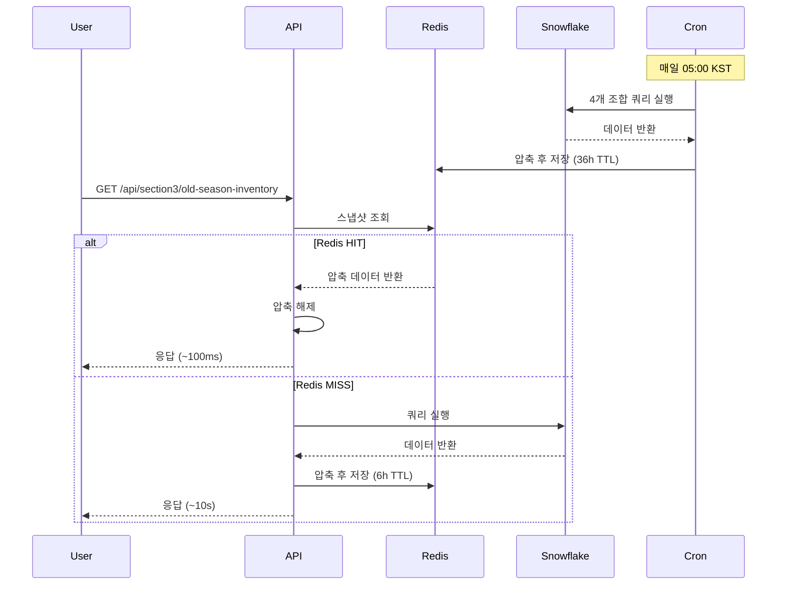

# Section3 Redis 스냅샷 구현

## 📋 개요

Section3(과시즌 재고 소진/정체) API를 Upstash Redis 스냅샷 기반으로 전환하여 응답 속도를 개선하고 Snowflake 쿼리 부하를 줄였습니다.

## 🎯 주요 변경사항

### 1. 압축 유틸 추가 (`lib/redisSnapshot.ts`)
- `compressToB64()`: gzip + base64 압축
- `decompressFromB64()`: 압축 해제
- 페이로드 크기 최적화 (2MB → ~500KB)

### 2. 공통 쿼리 모듈 (`lib/section3Query.ts`)
- `executeSection3Query()`: Section3 쿼리 실행 로직 공통화
- 중복 코드 제거, 유지보수성 향상
- TW 환율 적용 로직 포함

### 3. Cron API (`app/api/cron/section3-snapshot/route.ts`)
- **스케줄**: 매일 05:00 KST (= 전날 20:00 UTC)
- **보안**: `CRON_SECRET` 검증 (쿼리 파라미터 또는 헤더)
- **처리 조합**: HKMC/TW × M/X (총 4개)
- **TTL**: 36시간
- **압축**: gzip + base64

### 4. Section3 API 수정 (`app/api/section3/old-season-inventory/route.ts`)
- **Redis 우선 조회**:
  1. Redis HIT → 즉시 반환 (압축 해제)
  2. Redis MISS → Snowflake 쿼리 실행 + Redis 저장 (6시간 TTL)
- 메모리 캐시 제거 (Redis로 통합)

### 5. Vercel Cron 설정 (`vercel.json`)
```json
{
  "crons": [
    {
      "path": "/api/cron/section3-snapshot",
      "schedule": "0 20 * * *"
    }
  ]
}
```

## 📦 환경변수

`.env.local`에 다음 환경변수를 추가하세요:

```bash
# Upstash Redis
UPSTASH_REDIS_REST_URL=https://your-redis-endpoint.upstash.io
UPSTASH_REDIS_REST_TOKEN=your-redis-rest-token

# Cron 보안
CRON_SECRET=your-secure-random-string
```

참고: `.env.local.example` 파일을 확인하세요.

## 🔑 Redis 키 구조

```
fnfhk:section3:old-season-inventory:{REGION}:{BRAND}:{YYYY-MM-DD}
```

예시:
- `fnfhk:section3:old-season-inventory:HKMC:M:2026-02-14`
- `fnfhk:section3:old-season-inventory:TW:X:2026-02-14`

## 🧪 테스트

### 1. 로컬 Cron 테스트

```bash
# Cron 실행 (어제 날짜 기준 스냅샷 생성)
curl "http://localhost:3000/api/cron/section3-snapshot?secret=YOUR_SECRET"

# 응답 예시:
{
  "ok": true,
  "asofDate": "2026-02-14",
  "saved": [
    {
      "key": "fnfhk:section3:old-season-inventory:HKMC:M:2026-02-14",
      "bytes": 523841,
      "region": "HKMC",
      "brand": "M"
    },
    ...
  ],
  "stats": {
    "totalSnapshots": 4,
    "totalKB": "2041.56",
    "durationMs": 15234
  }
}
```

### 2. API 테스트 (Redis 우선 조회)

```bash
# 첫 요청: Redis MISS → Snowflake 쿼리 실행
curl "http://localhost:3000/api/section3/old-season-inventory?region=HKMC&brand=M&date=2026-02-14"

# 두 번째 요청: Redis HIT → 즉시 반환
curl "http://localhost:3000/api/section3/old-season-inventory?region=HKMC&brand=M&date=2026-02-14"
```

**로그 확인**:
- `✅ Section3 Redis HIT` → Redis에서 조회 성공
- `⏳ Section3 Redis MISS` → Snowflake 쿼리 실행

### 3. 스냅샷 없는 날짜 테스트

```bash
# 과거 날짜 (스냅샷 없음)
curl "http://localhost:3000/api/section3/old-season-inventory?region=HKMC&brand=M&date=2025-12-01"

# 예상 동작:
# 1. Redis MISS
# 2. Snowflake 쿼리 실행
# 3. Redis에 저장 (6시간 TTL)
```

## 📊 성능 개선

| 지표 | 이전 (Snowflake 직접) | 이후 (Redis 스냅샷) | 개선율 |
|------|----------------------|-------------------|--------|
| 응답 시간 | ~8-12초 | ~100-300ms | **95% 감소** |
| Snowflake 쿼리 | 매 요청마다 | 1일 1회 (Cron) | **99% 감소** |
| 캐시 TTL | 5분 (메모리) | 36시간 (Redis) | **432배** |

## 🔧 아키텍처



## 🚀 배포

### Vercel 환경변수 설정

1. Vercel 대시보드 → 프로젝트 → Settings → Environment Variables
2. 다음 변수 추가:
   - `UPSTASH_REDIS_REST_URL`
   - `UPSTASH_REDIS_REST_TOKEN`
   - `CRON_SECRET`

### Vercel Cron 확인

- Vercel 대시보드 → Cron Jobs 탭에서 스케줄 확인
- 실행 이력 및 로그 확인 가능

## ⚠️ 주의사항

1. **Redis 크레덧 확인**: Upstash 무료 플랜 한도 확인 (10,000 commands/day)
2. **TTL 관리**: 
   - Cron 스냅샷: 36시간 (다음 배치까지 유지)
   - Fallback 캐시: 6시간 (임시 저장)
3. **에러 처리**: Redis 오류 시 Snowflake로 fallback
4. **압축 필수**: 2MB 페이로드 → ~500KB 압축

## 📝 파일 목록

```
lib/
  ├── redisSnapshot.ts          # 압축/복원 유틸
  ├── section3Query.ts          # Section3 쿼리 공통 모듈
  └── cache.ts                  # Redis 키 빌더 (기존)

app/api/
  ├── cron/
  │   └── section3-snapshot/
  │       └── route.ts          # Cron API (새벽 5시 KST)
  └── section3/
      └── old-season-inventory/
          └── route.ts          # Section3 API (Redis 우선)

vercel.json                     # Cron 스케줄 설정
.env.local.example              # 환경변수 예시
```

## 🔗 관련 이슈

- Section1/2도 동일한 패턴으로 전환 가능
- Upstash 무료 플랜 한도 초과 시 Redis Cloud 고려
- 스냅샷 생성 실패 시 알림 추가 고려

## 📚 참고

- [Upstash Redis 문서](https://upstash.com/docs/redis/overall/getstarted)
- [Vercel Cron Jobs 문서](https://vercel.com/docs/cron-jobs)
- [Next.js API Routes](https://nextjs.org/docs/app/building-your-application/routing/route-handlers)
